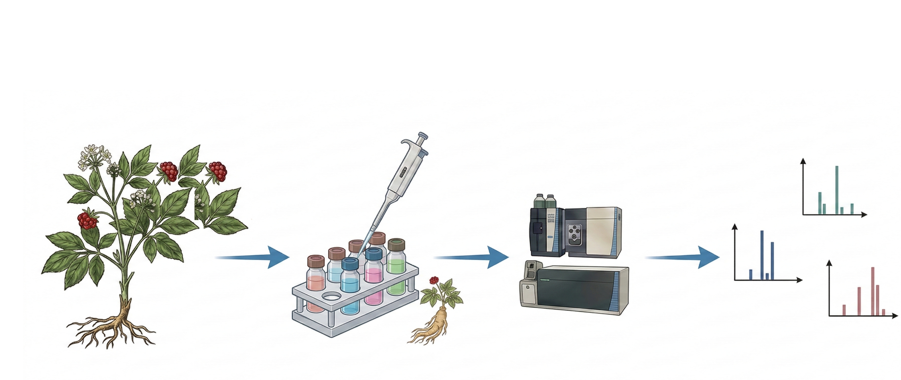
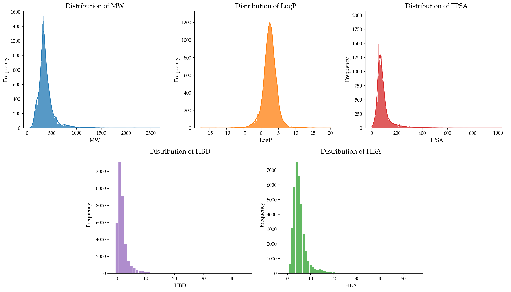
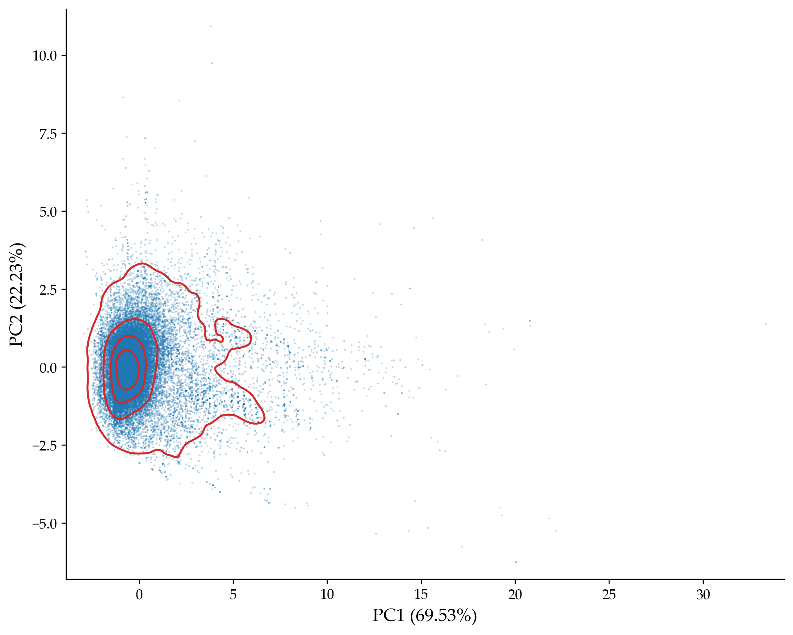

# TCM-MS2Link: A Unified Dataset Integrating TCM Herb–Compound Knowledge and MS/MS Spectral Data

<p align="center">
  <a href="https://opensource.org/licenses/MIT"></a>
  <a href="https://github.com/NIM-NMDC/TCM-MS2Link"></a>
  <a href="https://pytorch.org/"></a>
</p>

<p align="center">
  
</p>

**TCM-MS2Link** adopts a dual-layer “knowledge–data” architecture: the first layer, **TCM-MolLink**, comprises curated herb–compound association data, constructed through the integration of multiple heterogeneous databases and rigorous consistency filtering to establish high-confidence relationships between TCM herbs and their chemical constituents; the second layer, **MS2-MLReady**, is a benchmark dataset for mass spectrometry–based machine learning, which, after systematic data cleaning, standardized preprocessing, and well-designed data partitioning, can directly support the training and evaluation of artificial intelligence models.

> **📢 Notice**: Both the **complete dataset** and **source code** will be fully released upon the official acceptance of our paper.

---

## 📊 Dataset Info

|   Dataset    | Format | Records |                  Description                   |
| :----------: | :----: | :-----: | :--------------------------------------------: |
| TCM-MolLink  |  CSV   | 12,625  | High-confidence herb–compound association data |
| TCM-MS2Clean |  TSV   | 325,530 |          Curated MS/MS spectral data           |
| MS2-MLReady  |  TSV   | 284,729 |        Subset of [M+H]+ adduct spectra         |

The fully curated MS/MS dataset, **TCM-MS2Clean**, is provided as a supplementary resource. MS2-MLReady is derived from TCM-MS2Clean by retaining only spectra with the adduct type **[M+H]+**.

---

## 🔍  Discussion

These figures demonstrate that compounds in the MS2-MLReady dataset predominantly fall within the drug-like chemical space.






*The distributions of key physicochemical properties (MW, LogP, TPSA, HBD, and HBA), along with the PCA visualization of chemical space, indicate that the majority of compounds in the MS2-MLReady dataset fall within the typical drug-like region. This observation is broadly consistent with the criteria of Lipinski's Rule of Five, suggesting that the dataset primarily represents chemically relevant space for small-molecule drug discovery.*

---

## 📜 Citation

If you find TCM-MS2Link useful for your research, please cite:

```bibtex
@article{TCM-MS2Link2026,
  title   = {TCM-MS2Link: A Unified AI-Ready Dataset Integrating TCM Herb–Compound Knowledge and MS/MS Spectral Data},
  author  = {Qianjin Li},
}
